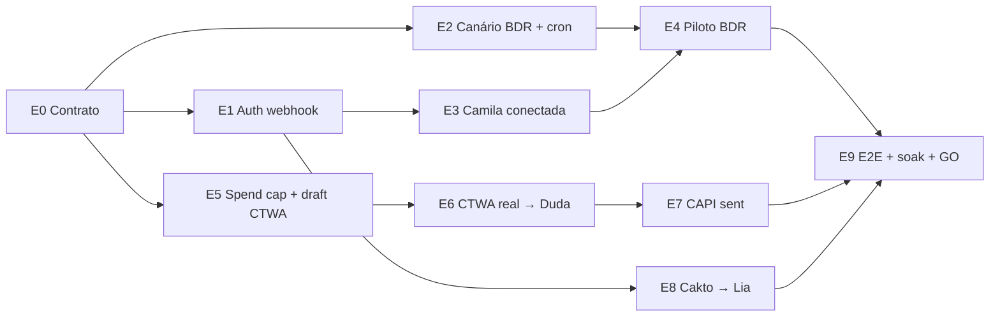

# Plano de execução — Go-live Duda (SDR) + Camila (BDR)

> **Data:** 2026-08-08  
> **Base medida:** `origin/main @ b069f7c` (merge da PR #148)  
> **Manifesto executável:** [`GO-LIVE-AGENT-MANIFEST.json`](GO-LIVE-AGENT-MANIFEST.json)  
> **Validação:** `npm run validate:golive-plan`  
> **Regra:** este documento explica o plano; o manifesto define DAG, papéis, critérios e gates que os agentes devem obedecer.

## 1. Objetivo e definição de pronto

Colocar em operação, com evidência real:

1. **Duda / SDR inbound:** clique CTWA → webhook Meta → lead/conversa → resposta da Duda → atribuição → CAPI.
2. **Camila / BDR outbound:** campanha autorizada → instância Evolution conectada → envio controlado → resposta → CRM, com opt-out e kill switch.
3. **Pós-venda:** pagamento Cakto → provisionamento → handoff no mesmo thread → Lia.
4. **Operação de Ads:** campanha CTWA com destino correto, delivery ativo e teto de gasto; mutações automáticas permanecem OFF durante o go-live.

O plano termina somente quando E0–E9 estiverem `done`, as evidências ainda apontarem para os SHAs mergeados, o soak de 24 horas passar e Marcelo registrar `GO`.

## 2. Correção factual importante

A auditoria anterior tratou autenticação de `webhook/set` como defeito estrutural aberto. A leitura da base atual mostrou um estado mais específico:

- `_shared/evolution-core.ts` monta `apikey: instanceToken || config.globalApiKey`;
- `configureWebhook` passa `instanceToken` ao `evoFetch`;
- `platform-evolution-proxy`, `evolution-proxy` e `demo-evolution` também passam o token;
- a PR #148 corrigiu a lista de eventos inválida no fluxo de demo.

Portanto, **E1 não começa alterando código**. Começa criando um teste de contrato nos quatro provisionadores; só corrige se o teste provar falha. O bloqueio runtime da Camila é outro: a instância foi observada em `close`, com falha de pareamento/Baileys 401, e é tratado em E3.

## 3. Princípios não negociáveis

1. **`origin/main` é a única base operacional.** Cada etapa nasce de `origin/main` atualizado.
2. **Não mergear `feat/bdr-autonomo` diretamente.** Resgatar somente o canário/agendamento de forma cirúrgica; o merge integral pode reintroduzir o defeito removido pela PR #148.
3. **Executor, verifier e reviewer são agentes diferentes.** Quem escreveu não valida nem revisa a própria entrega.
4. **Evidência pertence a um SHA.** Novo push invalida verify e review anteriores.
5. **Toda etapa usa o ciclo:** iniciar → entregar → conferir → aprovar.
6. **Máximo de duas iterações.** Terceira tentativa vira `escalated` com causa, opções e recomendação.
7. **Produção, gasto, número real, dados para terceiros, outbound e pagamento exigem Marcelo.** Agentes aprovam tecnicamente; não substituem o gate humano.
8. **Segredos nunca entram em PR, log ou screenshot.** Somente presença, digest ou valor mascarado.
9. **Operação também deixa diff auditável.** Etapa sem código abre PR de evidência em `tasks/evidence/<etapa>/<run>.md`.

## 4. DAG e caminho crítico



Após o merge de E0, **E1, E2 e E5 iniciam em paralelo**. O caminho crítico é:

`E0 → E1 → E3 → E4 → E9`

O inbound corre em paralelo:

`E0 → E5 → E6 → E7 → E9`

O pós-venda corre em paralelo depois de E1:

`E1 → E8 → E9`

## 5. Entregáveis e gates por etapa

### E0 — Contrato de orquestração

**Entrega**
- este plano;
- manifesto JSON com DAG, papéis, recursos, DoD e rollback;
- validador sem dependências externas;
- comando `npm run validate:golive-plan`.

**Conferência**
- JSON parseia;
- dez etapas E0–E9 existem;
- DAG não tem ciclo;
- todos os caminhos chegam a E9;
- critérios são binários;
- executor, verifier e reviewer são distintos.

**Aprovação**
- review independente `SAFE`;
- merge da PR controladora.

### E1 — Contrato de autenticação Evolution

**Entrega**
- teste cobrindo `evolution-proxy`, `platform-evolution-proxy`, `onboarding-evolution` e `demo-evolution`;
- assertion de `apikey == instanceToken`;
- caso negativo com token ausente;
- correção mínima apenas se a prova falhar;
- erro observável quando `webhook/set` não retorna 2xx.

**Conferência**
- saída identifica 4/4 caminhos;
- nenhum token aparece em claro;
- caso negativo bloqueia a chamada;
- PR #148 continua verde.

**Aprovação**
- técnica pelo controller após verify e review `SAFE`.

### E2 — Canário BDR + agendamento em main

**Entrega**
- canário de cobertura reconstruído ou cherry-picked cirurgicamente sobre main;
- agendamento versionado ou migration `pg_cron` idempotente;
- alerta para campanha autorizada sem instância conectada;
- prova explícita de não regressão da PR #148.

**Conferência**
- branch parte de main fresco;
- diff contém somente canário/agendamento;
- execução ocorre pelo scheduler, não manualmente;
- eventos inválidos da PR #148 não reaparecem.

**Aprovação**
- técnica pelo controller após verify e review `SAFE`.

### E3 — Canal real da Camila

**Entrega**
- diagnóstico preservando logs antes de qualquer reset;
- reparo ou novo pareamento somente se necessário;
- webhook 2xx com eventos válidos;
- round-trip com IDs dos dois sentidos.

**Conferência**
- instância `open/connected` em duas leituras separadas por 30 minutos;
- mensagem sai e resposta entra;
- evento chega à edge e ao CRM.

**Aprovação**
- técnica pelos agentes;
- **Marcelo aprova antes de reparar ou substituir o número real**.

### E4 — Piloto BDR controlado

**Entrega**
- campanha com no máximo 10 leads;
- cada lead com `approved_at` anterior ao envio;
- janela, jitter, limite diário, opt-out e kill switch provados em dry-run;
- relatório de entrega, resposta, erro e bloqueio.

**Conferência**
- zero envio sem aprovação;
- zero duplicidade;
- zero envio fora da janela;
- zero envio depois de opt-out.

**Aprovação**
- técnica pelos agentes;
- **Marcelo aprova lista, copy, janela e primeiro envio real**.

### E5 — Meta Ads com teto

**Entrega**
- spend limit resolvido sem retirar teto de segurança;
- conta, Página, WABA, pixel/dataset e destino conferidos;
- campanha CTWA canário em draft/paused, com budget e duração limitados;
- `ADS_MUTATIONS_ENABLED=false`.

**Conferência**
- Ads Manager mostra conta sem bloqueio de spend limit e teto documentado;
- preview abre o número oficial esperado;
- nenhum delivery real ocorre em E5;
- mutações automáticas permanecem OFF.

**Aprovação**
- técnica pelos agentes;
- **Marcelo aprova a alteração do spend limit, teto, duração, copy, criativo e destino**;
- a publicação e o primeiro gasto só podem ocorrer no gate de E6.

### E6 — Lead CTWA real na Duda

**Entrega**
- publicação da campanha previamente aprovada em E5;
- clique real;
- resposta da Duda no thread correto;
- `ctwa_clid`, campanha, adset e criativo persistidos;
- lead e conversa no CRM sem duplicidade.

**Conferência**
- `ads_attribution.ctwa_clid` não nulo;
- IDs correlacionam Meta webhook, mensagem e CRM;
- conversa orgânica continua sem atribuição falsa.

**Aprovação**
- técnica pelos agentes;
- **Marcelo aprova a publicação do anúncio-canário**.

### E7 — CAPI ativo e idempotente

**Entrega**
- dry-run do payload;
- secrets configurados por humano, sem exposição;
- `CAPI_ENABLED=true` somente depois de E6;
- scheduler observável;
- evento `pending → sent`.

**Conferência**
- Graph responde HTTP 200;
- reexecução não duplica `event_id`;
- erro deixa evento reprocessável.

**Aprovação**
- técnica pelos agentes;
- **Marcelo aprova o envio de conversão à Meta e o flip da flag**.

### E8 — Pagamento Cakto → Lia

**Entrega**
- dry-run com gate OFF;
- pagamento real controlado;
- ordem e organização deduplicadas;
- handoff Duda → Lia no mesmo thread;
- greeting da Lia sem duplicar welcome.

**Conferência**
- uma ordem e uma organização;
- um conversation ID;
- evento de handoff e greeting correlacionados.

**Aprovação**
- técnica pelos agentes;
- **Marcelo aprova valor/produto, pagamento real e `ONBOARDING_HANDOFF_ENABLED=true`**.

### E9 — Aceite integrado e go-live

**Entrega**
- matriz E1–E8 com links de evidência;
- E2E integrado;
- soak de 24 horas;
- drill dos kill switches;
- decisão GO/NO-GO.

**Conferência**
- E4, E7 e E8 estão `done`;
- nenhuma evidência foi invalidada por push/redeploy;
- zero alerta P0 no soak;
- gasto não ultrapassa o teto;
- nenhum envio indevido ou duplicado.

**Aprovação**
- verify e review finais por agentes diferentes;
- **Marcelo registra GO ou NO-GO**.

## 6. Protocolo dos agentes

### 6.1 Iniciar

O controller só muda a etapa para `claimed` quando:

- todas as dependências estão `done`;
- `git fetch origin main` foi executado;
- branch nova parte do SHA atual de `origin/main`;
- executor, verifier, reviewer e approver estão nomeados;
- escopo, recursos e comandos de prova estão declarados;
- human gate aplicável já tem responsável.

### 6.2 Entregar

O executor abre PR draft contendo:

```markdown
## Etapa
E<n> — <título>

## Subject
- Base SHA:
- Head SHA:
- Arquivos/recursos:
- Iteração: 0/2

## Entregáveis
- [ ] ...

## Self-checks
- Comando:
- Saída:

## Como me provar errado
1.
2.

## Rollback
- Gatilho:
- Ação:

## Evidência
_Preenchida pelo verifier, não pelo executor._
```

Novo push depois da entrega volta a etapa para `delivered` e apaga validade das aprovações anteriores.

### 6.3 Conferir

O verifier:

1. confirma que o `head SHA` não mudou;
2. confirma `origin/main` atualizado;
3. roda todos os critérios do manifesto;
4. executa os casos “como me provar errado”;
5. grava saída bruta redigida em `tasks/evidence/<etapa>/<run>.md`;
6. emite apenas `PASS` ou `FAIL`;
7. não edita o branch.

### 6.4 Revisar

O reviewer analisa:

- correção runtime;
- regressões;
- authn/authz, segredo e LGPD;
- idempotência;
- blast radius;
- rollback;
- coerência entre diff e evidência.

Saídas possíveis:

- `SAFE`: pode seguir para aprovação;
- `RISKY`: volta para implementação e incrementa a iteração;
- `REJECT`: violação estrutural; escala imediatamente.

### 6.5 Aprovar

Há dois níveis:

1. **Aprovação técnica:** controller confirma verify `PASS` + review `SAFE`.
2. **Aprovação humana:** Marcelo registra `APROVO` para ação externa/irreversível.

Silêncio não é aprovação. Agente não pode inferir consentimento para gasto, número real, produção, outbound, envio de dados ou pagamento.

## 7. Evidência mínima

Cada evidência deve registrar:

```yaml
stage: E<n>
run: "001"
subject:
  base_sha: "<sha>"
  head_sha: "<sha>"
  environment: "<local|shared-backend|production>"
collected_at: "<ISO-8601>"
actor: "<verification-agent-id>"
commands:
  - command: "<comando>"
    exit_code: 0
    result: "<resumo sem segredo/PII>"
verdict: "<PASS|FAIL>"
```

Screenshot sem data/objeto identificável não prova estado. Log sem comando não prova reprodução. Evidência de outro SHA não prova a entrega atual.

O limite de 60 minutos vale na transição `verifying → reviewing`. A evidência histórica permanece como auditoria, mas não autoriza uma transição futura. E9 deve recoletar os smokes finais de E4, E7 e E8 nos 60 minutos anteriores ao aceite integrado.

## 8. Ordem das PRs filhas

1. **PR-A / E0:** contrato de orquestração.
2. **PR-B / E1:** testes de autenticação dos webhooks.
3. **PR-C / E2:** canário BDR + agendamento.
4. **PR-D / E3:** registro operacional da recuperação da Camila.
5. **PR-E / E4:** evidência do piloto BDR.
6. **PR-F / E5:** evidência spend cap + campanha em draft.
7. **PR-G / E6:** evidência do CTWA real.
8. **PR-H / E7:** ativação e prova CAPI.
9. **PR-I / E8:** E2E Cakto → Lia.
10. **PR-J / E9:** aceite integrado e GO/NO-GO.

PR-B, PR-C e PR-F são independentes e podem correr em paralelo depois da PR-A. PRs operacionais adicionam apenas evidência redigida; nenhuma credencial entra no Git.

## 9. Escalada após duas falhas

Depois de duas iterações, o controller encerra tentativas automáticas e publica:

```yaml
status: escalated
stage: E<n>
failed_attempts:
  - hypothesis: ""
    change: ""
    observed: ""
minimal_repro: ""
known: []
unknown: []
options:
  - id: A
    action: ""
    cost: ""
    risk: ""
recommendation: ""
decision_required_from: Marcelo
```

Escala imediatamente, sem gastar duas iterações, se houver:

- envio para lead não aprovado;
- gasto acima do teto;
- segredo exposto;
- perda de sessão/número;
- operação destrutiva;
- evidência contraditória;
- diff fora do escopo;
- regressão da PR #148.

## 10. Critério de parada e primeira onda

**Primitiva correta:** PRs e gates por evento; scheduler/cron apenas para canários e dispatchers recorrentes. Não usar loop de LLM para esperar estado externo.

**Critério binário de parada:** `npm run validate:golive-plan` verde nesta PR; depois, cada etapa só fecha quando todos os seus critérios no manifesto estiverem `PASS`.

**Primeira onda após merge desta PR:**

1. controller abre E1, E2 e E5;
2. três executores distintos fazem claim;
3. cada entrega recebe verifier e reviewer próprios;
4. nenhuma ação externa ocorre antes dos human gates;
5. E3, E4, E6, E7, E8 e E9 são liberadas pelo DAG, não por decisão informal.

## 11. Qualidade do plano

Rubrica aplicada:

- critério de parada + primitiva correta: 30%;
- completude das três jornadas: 20%;
- dependências e paralelismo: 15%;
- evidência independente: 15%;
- segurança, rollback e gates humanos: 10%;
- execução por agentes/máquina: 10%.

Trajetória de endurecimento: `76 → 88 → 94 → 94` (platô).

As maiores correções foram: separar o contrato de autenticação do incidente de pareamento; transformar operações sem código em PRs auditáveis de evidência; e impedir que aprovação técnica de agente substitua consentimento humano em ações irreversíveis.
